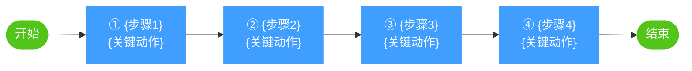
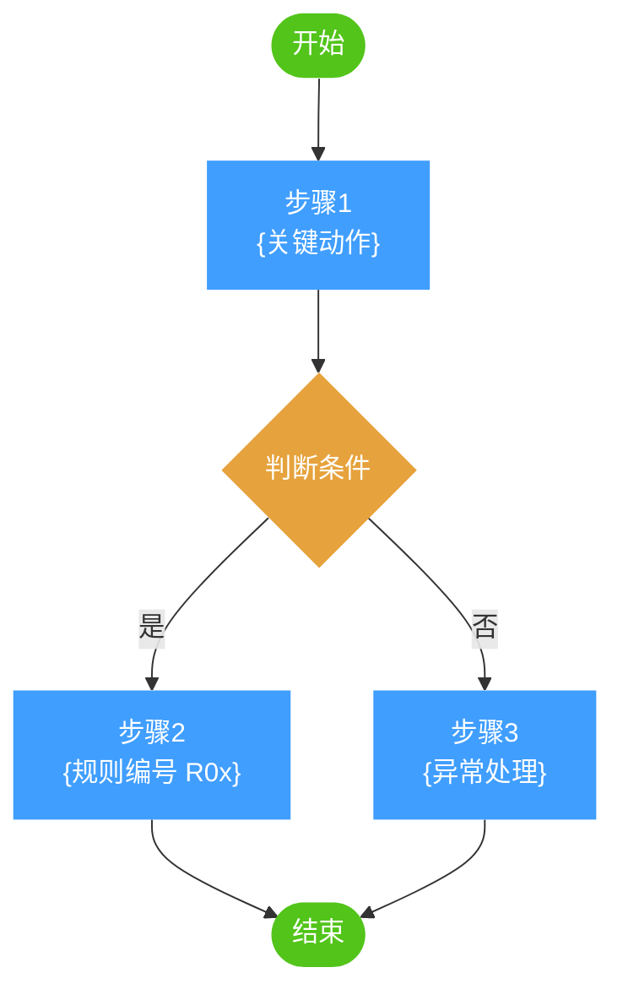
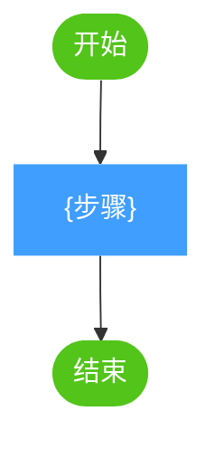
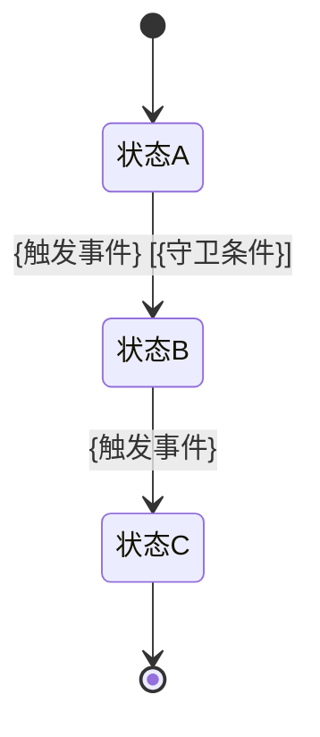
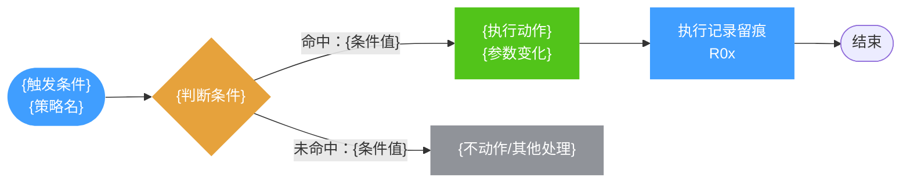
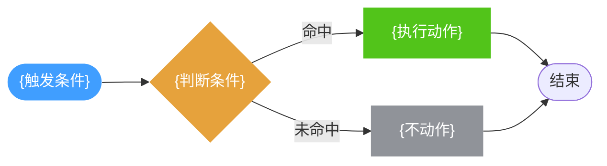

# PRD - {功能名}

| 属性 | 值 |
|------|-----|
| 版本 | {版本号} |
| 适用范围 | {适用范围} |
| 创建日期 | {日期} |
| 状态 | {状态} |
| 关联原型 | [原型设计文档](../prototype/{功能名}-prototype.md) |

<!-- 全文篇幅红线（引用规则 F11）：单段落 ≤3 行（≈100 字），超出必须拆为列表/表格；全文目标 400~600 行，>700 行 Reviewer 简洁可读维度扣分 -->
<!-- 每章固定以「本章要点」块开篇：3~5 行结论，业务读者只读要点即可评审，开发读者继续读正文 -->

---

## 1. 概述

> **本章要点**：{3~5 行写清：做什么、为什么做、做到什么程度（成功指标）、不做什么}

### 1.1 业务完整流程

<!-- 端到端业务流程概览：面向读者的业务叙述（简化版），区别于 §2.1 面向开发的技术细节 -->
<!-- 绘制遵循 D03 活动图语义：stadium 起止、动作矩形、5~7 步 -->



*图 1-1：{业务名称}完整业务流程。{一句话总结：谁做什么、系统自动完成什么、最终结果是什么。详细技术流程见 §2.1。}*

### 1.2 背景与目标

{描述当前系统现状、用户痛点、为什么需要这个功能。3 句话以内说清问题。}

**目标**：
1. **目标1**：{量化描述}
2. **目标2**：{量化描述}

**非目标**（明确排除）：
1. {不做什么 — 防止范围蔓延}
2. {不做什么}

**成功指标**：{可衡量的完成/失败标准，如：响应时间 < 2s、覆盖率 > 90%}

### 1.3 范围定义

- **适用范围**：{店铺类型 / 站点 / 业务模式}
- **不包含**：{明确排除的内容}
- **前置依赖**：{上线前必须存在什么 — 系统依赖、数据准备、权限配置}

### 1.4 术语与分类

| 术语 | 英文标识 | 说明 |
|------|---------|------|
| {术语1} | `{EnglishId}` | {定义} |
| {术语2} | `{EnglishId}` | {定义} |

**分类枚举**（使用中文用户界面标签）：
- {分类1}：`{用户可见值1}` / `{用户可见值2}` / `{用户可见值3}`
- {分类2}：`{用户可见值1}` / `{用户可见值2}`

<!-- Ch1 整章 ≤80 行 -->

---

## 2. 流程与规则

> **本章要点**：{3~5 行写清：主流程关键路径、核心规则数量与分组、关键状态流转}

> 本章是业务逻辑的**唯一权威来源**。所有规则只出现一次。
> 开发者：需要某条业务规则时，只在本章查找。

### 2.1 核心业务流程

<!-- ⚠️ 必须最小颗粒度（D05）：节点拆到子步骤可独立验证级别，关键业务约束（时间窗口/阈值/重试上限）一句话写进节点文案；
     图步骤与 §2.2.x 正文逐步对齐、编号一致。绘制遵循 D03 活动图语义：stadium 起止、判断菱形带分支标签、分支显式合并 -->

```mermaid
flowchart TD
    S([开始]) --> B{"{判断条件组}<br/>{规则一句话，如：可拉截止点 = 当前之后下一个 15:00}"}
    B -->|{条件1}| C["{子步骤1}<br/>{规则编号 R0x}"]
    B -->|{条件2}| D["{子步骤2}<br/>{规则编号 R0y}"]
    C --> M{"{合并判断}"}
    D --> M
    M -->|{通过}| E["{结果1}"]
    M -->|{不通过}| F["{结果2}"]
    E --> Z([结束])
    F --> Z

    classDef main fill:#409eff,color:#fff,stroke:none
    classDef decision fill:#e6a23c,color:#fff,stroke:none
    classDef ok fill:#52C41A,color:#fff,stroke:none
    classDef fail fill:#F5222D,color:#fff,stroke:none
    class C,D main
    class B,M decision
    class E ok
    class F fail
```

*图 2-1：{核心流程名称}。{一句话总结主流程关键路径和分支；说明各子步骤对应 §2.2.x 的哪个子流程。}*

### 2.2 子流程详述

<!-- 每个子流程小节 = Mermaid 图 + 简短说明（≤8 行）；图遵循 D03 活动图语义，文字仅作图注与分支补充 -->

### 2.2.1 {子流程1名称}

<!-- 每个子流程必须配 Mermaid flowchart TD 图（W13） -->


*图 2-{x}：{子流程名称}。{一句话总结关键路径与分支。}*

**要点**（≤8 行）：
1. {图注补充说明，如校验回退、状态联动等}

### 2.2.2 {子流程2名称}



*图 2-{x}：{子流程名称}。{一句话总结。}*

**要点**（≤8 行）：
1. {补充说明}

### 2.3 状态流转（如适用）

<!-- 绘制遵循 D04：[*] 初终态、转移标注「事件 [守卫条件] / 动作」；状态机图不可省略 -->



*图 2-2：{对象名}状态流转。{一句话总结状态数量与关键流转路径。}*

| 状态 | 触发条件 | 下一状态 | 备注 |
|------|---------|---------|------|
| `状态A` | {条件} | `状态B` | {说明} |
| `状态B` | {条件} | `状态C` | {说明} |

### 2.4 业务规则索引

> 跨模块业务规则的统一定义。界面章节（Chapter 4）与使用场景章节（Chapter 3）引用规则编号，不重复规则内容。

| 规则ID | 规则名称 | 描述 | 引用章节 |
|--------|---------|------|---------|
| R01 | {规则名称} | {规则描述} | 3.{x} / 4.{x} |
| R02 | {规则名称} | {规则描述} | 3.{x} / 4.{x} |
| R03 | {规则名称} | {规则描述} | 3.{x} / 4.{x} |

### 2.5 边界与异常

| 场景 | 触发条件 | 处理方式 |
|------|---------|---------|
| {边界场景1} | {条件} | {处理} |
| {异常场景1} | {条件} | {处理} |

---

## 3. 使用场景

> **本章要点**：{3~5 行写清：覆盖哪几类典型情境（创建/调整/异常/生命周期）、系统在各情境下的核心行为}

> 本章以具体业务场景举例说明系统「什么时候会自动做什么」，帮助运营与研发对齐预期。场景中涉及的规则细节以 §2.4 规则定义为准（仅引用规则编号，不重复规则内容），页面操作细节见第 4 章交互原型。
> 统一示例背景：{运营角色名} 负责 {店铺名}（{站点} 站点，{业务领域}）。

<!-- 场景数量收紧为 3~5 个；每个场景只含 4 要素：场景背景（≤2 句）+ 示意图+图注 + 关键规则 + 对应页面。禁止「系统行为举例」长段 -->

### 3.1 {场景1名称}

**场景背景**：{什么业务情境下需要这个能力，痛点是什么，运营配置了什么策略/做了什么操作。≤2 句}。



*图 3-1：{场景1名称}场景。{一句话总结：触发条件 + 判断逻辑 + 执行结果，引用关键规则编号}。*

**关键规则**：{本场景涉及的核心规则，引用规则编号，如 R01/R02/R03（规则内容见 §2.4）}。
**对应页面**：{相关页面名}（§4.{x}）。

### 3.2 {场景2名称}

**场景背景**：{另一个业务情境说明。≤2 句}。



*图 3-2：{场景2名称}场景。{一句话总结}。*

**关键规则**：{引用规则编号}。
**对应页面**：{相关页面名}（§4.{x}）。

---

## 4. 交互原型

> **本章要点**：{3~5 行写清：包含哪些模块/页面、各模块对应哪个 proto-*.html、核心交互逻辑}

> 本章在每个模块小节中嵌入式展示交互原型，支持全屏查看。
> 业务规则引用 Chapter 2 的规则 ID（如 R01、R02）。
> HTML 渲染时：每个 4.x 小节必须使用 `.proto-embed` 包裹 iframe，含全屏查看按钮。

### 4.1 {模块1名称} → proto-search.html

<!-- HTML 渲染版原型嵌入结构
<div class="proto-embed" data-proto-src="../prototype/proto-search.html" data-proto-title="{模块1名称}" role="region" aria-label="原型预览：{模块1名称}">
  <div class="proto-embed-header">
    <span class="proto-title">{模块1名称}</span>
    <button class="proto-open-btn">全屏查看</button>
  </div>
  <iframe src="../prototype/proto-search.html" loading="lazy" title="{模块1名称}原型预览"></iframe>
</div>
-->

> 对应原型文件：[proto-search.html](../prototype/proto-search.html)

**标注点说明**：

<!-- 只写交互逻辑（为什么这样设计、触发什么规则），禁止颜色/字号/间距等样式描述 -->
<!-- HTML 渲染版：此表格添加 class="anno-table" data-section="{N}.x {模块名}"，
每行添加 data-anno="{编号}"，编号列和原型标注圆圈点击可打开右侧标注抽屉 -->

| # | 内容 | 说明 |
|---|------|------|
| 1 | {要素1} | {交互逻辑} |
| 2 | {要素2} | {交互逻辑} |

**页面结构**：
1. 区域A：{描述}
2. 区域B：{描述}

**交互行为**：
- 用户{操作} → {结果}（引用规则 R01）
- **条件**：{条件} → **结果**：{动作}

**字段定义**：

| 界面字段 | 控件 | 数据字段 | 规则 |
|---------|------|---------|------|
| {字段1} | {控件类型} | `{fieldName}` | {规则说明} |
| {字段2} | {控件类型} | `{fieldName}` | 枚举：`用户可见值1` / `用户可见值2` |

**筛选/搜索字段**（如适用）：

| 字段 | 控件类型 | 默认值 | 说明 |
|------|---------|--------|------|
| {字段1} | 下拉选择 | `{默认}` | {说明} |

### 4.2 {模块2名称} → proto-table.html

> 对应原型文件：[proto-table.html](../prototype/proto-table.html)

**标注点说明**：

| # | 内容 | 说明 |
|---|------|------|
| 1 | {要素1} | {交互逻辑} |

**表格列定义**：

| 列名 | 数据字段 | 说明 | 备注 |
|------|---------|------|------|
| {列1} | `{fieldName}` | {说明} | {备注} |

**操作列规则**：

| 条件 | 操作按钮 | 引用规则 |
|------|---------|---------|
| {条件1} | {按钮列表} | R0{x} |

### 4.3 {弹窗/模态框名称} → proto-{modal}.html

> 对应原型文件：[proto-{modal}.html](../prototype/proto-{modal}.html)

**标注点说明**：

| # | 内容 | 说明 |
|---|------|------|
| 1 | {要素1} | {交互逻辑} |

**弹框内容**：

1. **区域1**：{描述}
2. **区域2**：{描述}

**弹框字段**：

| 字段 | 控件 | 数据字段 | 规则 |
|------|------|---------|------|
| {字段1} | {控件} | `{fieldName}` | {规则说明} |

**操作规则**：
- {规则描述}（引用规则 R0{x}）

### 4.4 {操作类模块：确认/提交操作}

**触发方式**：{如何触发}

**二次确认**：{确认弹框文案}

**成功结果**：
- {结果描述}

**失败处理**：
- {错误提示}（引用可行性验证报告）

---

## 附录

### A. 相关规范

- [UI 样式与交互规范](../../../docs/rules/ui-standard/index.html)

### B. 变更记录

<!-- 日期时间格式 YYYY-MM-DD HH:mm；新行置顶、按日期时间降序（最新在最上），同日按时间降序 -->

| 日期时间 | 版本 | 变更内容 | 作者 |
|------|------|---------|------|
| {YYYY-MM-DD HH:mm} | {版本} | 初始版本 | {作者} |
| 2026-08-11 17:00 | v4.2 | ①附录新增「A. 相关规范」小节，含 UI 样式与交互规范相对路径链接（`../../../docs/rules/ui-standard/index.html`），原「A. 变更记录」重编号为 B；②HTML 渲染新增 H11 规则（链接 `target="_blank"` 新窗口打开）+ 断言9 校验 | PM-Agent |
| 2026-08-10 15:30 | v4.1 | ①附录删「A. 业务规则完整索引」（与 §2.4 正文规则索引重复，违反 F10 去重原则），原「B. 变更记录」重编号为 A；②变更记录日期列升级为「日期时间」（YYYY-MM-DD HH:mm）且新行置顶降序；③附录结构收敛为单节 | PM-Agent |
| 2026-08-04 00:00 | v4.0 | ①每章新增「本章要点」块（双层阅读：业务读要点、开发读正文）；②Ch3 场景 6 要素砍为 4 要素（删「系统行为举例」长段）、场景数 3~8 收紧为 3~5；③图示例按 UML 语义约定重写（D03 活动图 stadium 起止/判断菱形/分支合并、D04 状态机守卫条件）；④附录删「原型文件对照」「图表清单」，保留规则索引+变更记录；⑤标注点说明限定交互逻辑、5.4 仅列真阻塞项；⑥补 F11 篇幅红线与 Ch1 ≤80 行、2.2.x ≤15 行上限 | PM-Agent |
